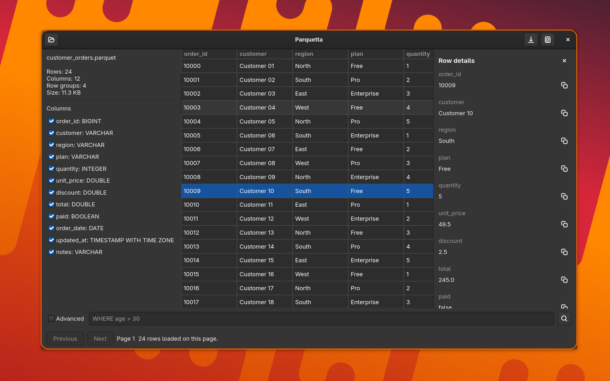

# Parquetta

[](https://github.com/ogregorio/parquetta/actions/workflows/ci.yml)
[](https://github.com/ogregorio/parquetta/actions/workflows/release-packages.yml)

Parquetta is a GTK4 desktop viewer for Parquet files, built with Rust and
DuckDB. It queries Parquet files directly with SQL, so previews, filters, and
exports do not need to load the full file into application memory first.



## Features

- Open local `.parquet` files.
- Inspect row count, columns, types, row groups, and file size.
- Preview rows in a paginated `Gtk.ColumnView`.
- Select which columns should be shown in normal preview mode.
- Filter with a simple `WHERE` clause, such as `WHERE age > 30`.
- Run advanced SQL with `{{file}}` as the Parquet placeholder.
- Open row details from a selected table row.
- Copy individual row-detail values.
- Export query results to CSV or Parquet.

## Query Modes

Normal mode keeps pagination and column selection under the app's control. The
filter field accepts only the predicate part:

```sql
WHERE total > 100 AND paid = true
```

Advanced mode accepts a complete DuckDB query. Use `{{file}}` wherever the
current Parquet file should be read:

```sql
SELECT region, count(*) AS orders, sum(total) AS revenue
FROM {{file}}
GROUP BY region
ORDER BY revenue DESC
```

## Requirements

Install Rust, GTK4, and the native build tools for your distribution.

```bash
# Fedora
sudo dnf install rust cargo gtk4-devel libadwaita-devel pkgconf-pkg-config clang

# Ubuntu / Debian
sudo apt install rustc cargo libgtk-4-dev libadwaita-1-dev pkg-config clang
```

The `duckdb` crate is built with bundled DuckDB and Parquet support.

## Run

```bash
cargo run
```

## Build

```bash
cargo build --release
./target/release/parquetta
```

## Releases

When the package version in `Cargo.toml` changes on `main`, GitHub Actions
builds and publishes:

- Debian package: `.deb`
- RPM package: `.rpm`
- Flatpak bundle: `.flatpak`

The release workflow tags the commit as `v<version>` and publishes the packages
to the GitHub release with generated release notes.

## Architecture

```text
GTK4 App
 ├── File picker
 ├── Metadata and column sidebar
 ├── SQL filter / advanced query field
 ├── Gtk.ColumnView preview
 ├── Row details panel
 └── DuckDBService
      ├── get_schema()
      ├── get_metadata()
      ├── query_page(limit, offset, columns, where)
      └── export_result()
```
